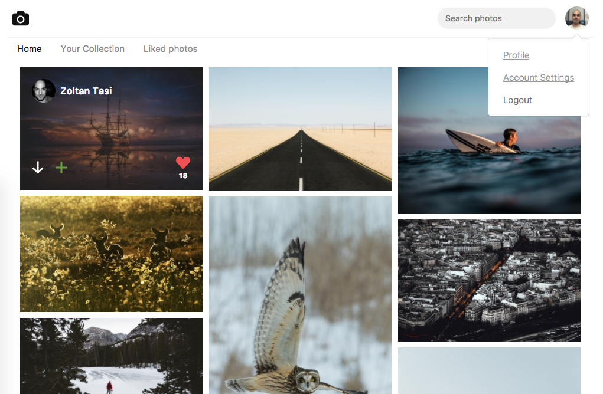
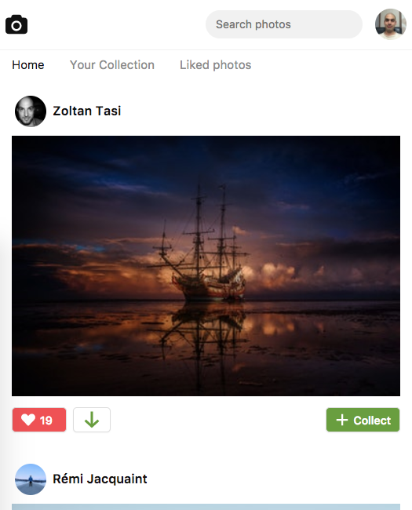
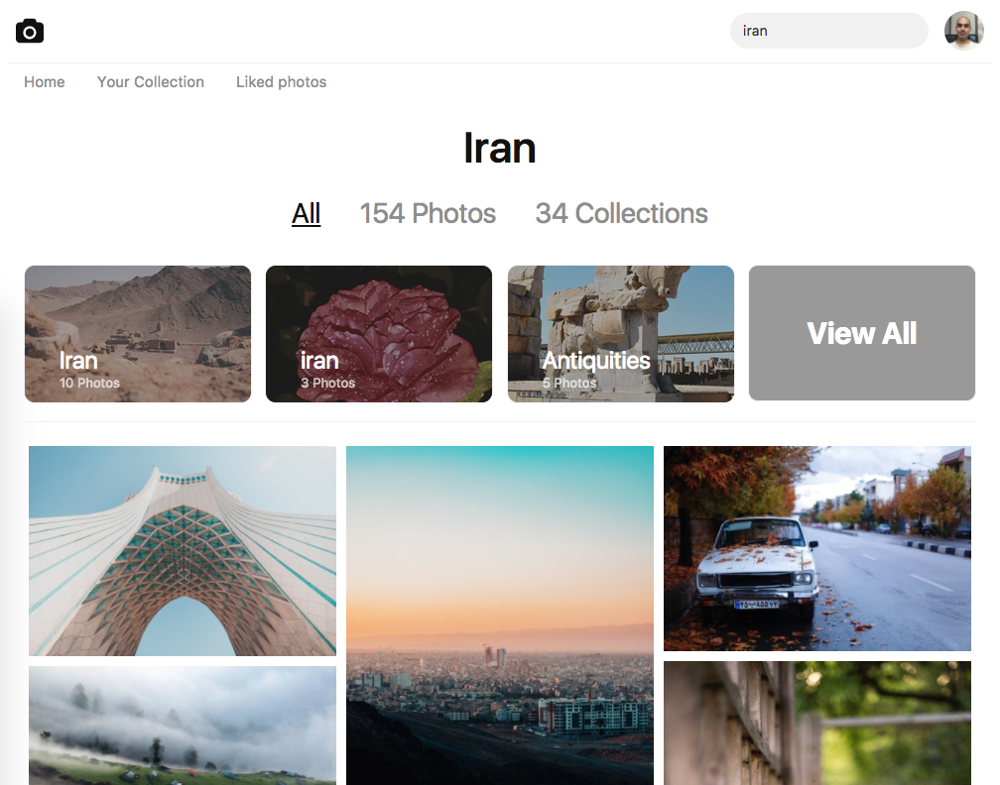
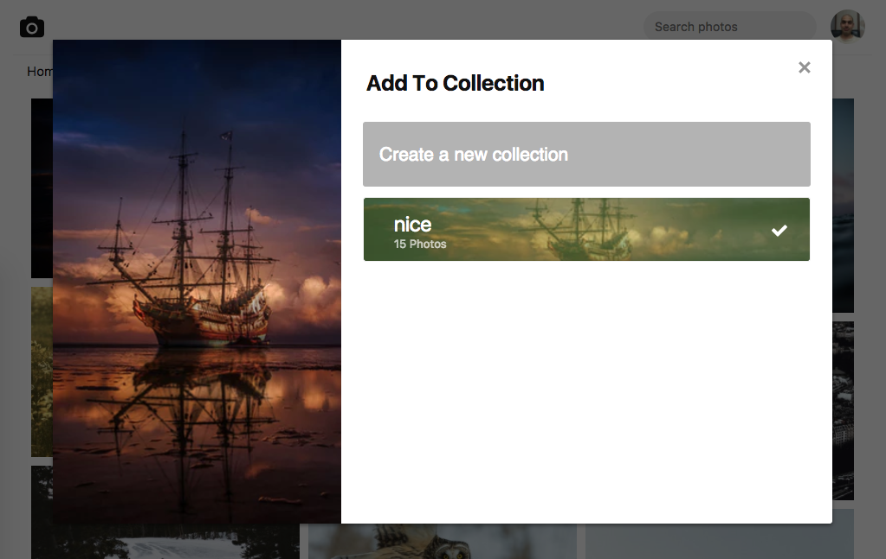

[](https://travis-ci.org/atahani/reactjs-unsplash)

# Unsplash Clone

## Introduction

This project was developed to demonstrate how you can develop a React.js web application like [unsplash](https://unsplash.com/) from scratch. All of the components have been developed without any third parties library like [react-bootstrap](https://react-bootstrap.github.io/). If you understood Persian, you would be able to enroll this course in [Faranesh.com.](https://faranesh.com/web/16454-clone-unsplashcom-with-reactjs--redux)

> This project has written only for educational purpose. So we don't want to abuse the name or idea of [unsplash.com](https://medium.com/unsplash/unsplash-api-guidelines-28e0216e6daa).

## How Does It Look Like?







## Some Libraries that have been used

#### Flow

Everybody nags about JavaScript is loosely typed language, and most of the bugs come from this feature. There are two ways to handle static type checking, [TypeScript](https://www.typescriptlang.org/), and [flow](http://flow.org/). I've used flow since I love ES6 syntax.

#### Jest

[Jest](https://facebook.github.io/jest/) is the best tool for testing React.js applications. It has some cool features like [Snapshot](https://facebook.github.io/jest/docs/en/snapshot-testing.html).
Since this project was developed for educational, Only some tests have been written to demonstrate how tests should be by Jest library.

#### styled-components

There are many libraries to handle style in React. One of the best libraries is [styled-component](https://www.styled-components.com/) since you can manage style of components base on behaviors.

#### Redux Persist

[Redux](https://redux.js.org/) was used as store management Since we don't want to lose user informations such as user profile or access token. [Redux Persist](https://github.com/rt2zz/redux-persist) was used to store user state into local storage. The configuration is easier than you would think!

## Pre Requirements

1.create new application

Since this project is based on [unspalsh API](https://unsplash.com/documentation) you need to have an application. Follow [this link](https://unsplash.com/oauth/applications/new) to create a new application. You need to set these permissions.

```
public
read_photos
write_likes
read_collections
write_collections
```

> NOTE: The `Redirect URI` is `http://localhost:3030/auth/callback` in development mode base on default settings.

2. create a file with `.env_development` OR `.env_production` name to set environment variables like `.env_sample`

```
NODE_ENV=development

ROOT_URL=https://unsplash.com

API_ROOT=https://api.unsplash.com/

CLIENT_ID=XXXXXXXXXXXXX

CLIENT_SECRET=XXXXXXXXXXXXX

OAUTH_PATH=https://unsplash.com/oauth/authorize?client_id=XXXXXXXXXXXXX&redirect_uri=http%3A%2F%2Flocalhost%3A3030%2Fauth%2Fcallback&response_type=code&scope=public+read_photos+write_likes+read_collections+write_collections

REDIRECT_URI=http://localhost:3030/auth/callback
```

## Project Commands

#### Start App in Development Mode
```
yarn run start
```

#### Test

```
yarn run test
```

#### Test in Watch Mode

```
yarn run test-w
```

#### Flow Checking

```
yarn run flow
```

#### Linting

```
yarn run lint
```

#### Build Project in Production Mode

```
yarn run build
```

#### Build and Run Server

```
yarn run build-and-run-server
```

#### Run Server Only

```
yarn run run-server
```